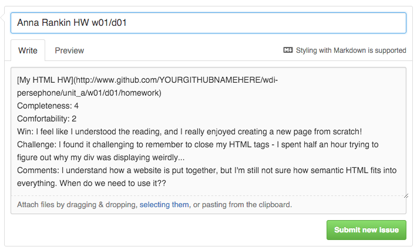

# Homework Submission How-To

As a WDI student, you'll be expected to complete and submit homework assignments on a daily basis. These homework assignments will challenge you, encourage you to explore beyond what we learn in class, and give you a chance to practice and expand on your skills. As a reminder - **you must complete at least 80% of this class's homework** in order to achieve graduation status. Plus, it's *good* for you! We promise.

## WDI Persephone Homework Submission Guide

### Step One: Do your homework.

1. Complete your homework inside your `wdi-persephone` folder inside the correct unit/week/day.
- Add, commit, and push your work up to Github.
  1. Navigate to the **top** of your `wdi-persephone` repo. Adding, committing & pushing from here ensures all of the code in our folder will be synced with our cloud repository.
  - `git add .` - adds all of the work you've done inside your repo.
  - `git commit -m "homework w01/d01"` - leave a nice, descriptive commit message.
  - `git pull origin master` - it's always a good idea to pull down any changes you (or in the future, your teammates/coworkers) have made before you try to push.
  - `git push origin master` - pushes the code you've added & committed to Github.
- Check in your browser - is all of your work online and up-to-date? If so...

### Step Two: Submit it to us.

1. Navigate to our main [class repo](https://github.com/ga-students/wdi-persephone) and click on the **Issues** link on the right side of the page.
- Create and submit a new issue.[1](#why-github-issues)
  - **Title your issue** with your name, HW, and the week/day the assignment was assigned.
  - ***INCLUDE A LINK TO YOUR ASSIGNMENT.*** Paste in the link to the folder in your repo where you completed your homework. It will probably look something like this:  `http://www.github.com/YOURGITHUBNAMEHERE/wdi-persephone/unit_a/w01/d01/homework`
  - **Include a brief self-assessment.** This is a chance for you to get better at talking about your code and to let us know where you feel your strengths and weaknesses lie. The more specific you are, the more targeted our guidance can be! Your assessment will include:
    - **Completeness:** scale of 0 to 5
    - **Comfortability:** scale of 0 to 5
    - **Win:** What is something that felt good during the assignment?
    - **Challenge:** What did you find the most challenging?
    - **Comments:** Any other comments about this assignment?

**[Markdown formatting](https://guides.github.com/features/mastering-markdown/) is supported by Github issues**, so take advantage of the ability to embed code snippets and more!

#### Example:

### Step Three: Get some sleep.

***Seriously.***

## What do these commands mean?!??

## Why Github Issues?

Github issues are commonly used by developers to track or report bugs, problems, and feature requests. We've chosen to have you submit your homework using them for several reasons:

- Issues are easy to track, for you and for us.
- They enable us to have a conversation thread dedicated to a particular assignment.
- You'll get more comfortable using Github and writing markdown.
