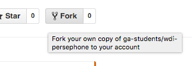
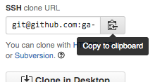
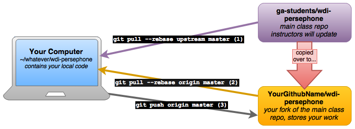

# How to Set Up Your Class Repo

### Step-by-Step:

**Note:** You should only need to do this once.

1. **Navigate to the [master `wdi-persephone` repo](https://github.com/ga-students/wdi-persephone).** This is the repo your instructors will be pushing classwork, guides, labs, project prompts, code samples, and **so much more** to during this course.
- **Create a fork**, or copy, of this repo to your own Github account.  
- Congratulations! **You now have your own copy of the class repo.** Once you're redirected to your new fork's page (the URL should look like this: `https://github.com/YourGithubNameHere/wdi-persephone`), copy the ***SSH clone URL*** (not the HTTPS URL) from the right-hand side of the page.  
- **Now it's time to clone that code down onto your machine.** Open up your terminal, navigate to a folder ***outside of any current git repo*** (Hint: type `git status` to check and see if you're already inside a repo) and **clone** your personal copy of the class's repo down to your local machine. `git clone TheSSHURLYouJustCopied`
- **Navigate inside the new `wdi-persephone` folder that was just created.** Now our repo is set up to push and pull to Github! One last step: **Add a git remote** named `upstream` that will allow you to pull down code from the main class repository. `git remote add upstream git@github.com:ga-students/wdi-persephone.git`

## What Just Happened?

We'll learn more about Git and Github in the coming weeks, but here's a simple diagram to help you understand how our repos are set up and how you'll be using them.

1. `git pull upstream master` - Pulls down code from the **main class repo** that we, as instructors, will push resources and class materials to. This is how you'll obtain starter code and prompts for assignments.
- `git pull origin master` - Pulls code down from **your fork of the main class repo**. You can use this to synchronize the work you've done from another computer.
- `git push origin master` - Pushes your work up to **your fork of the main class repo** in the cloud so that others can see it. It's super important to do this every night before you submit your homework so that we can see your code.

### Helpful Tip

**When pushing or pulling, make sure you're at the top of your `wdi-persephone` directory. This ensures your entire fork or local files are updated.**

***Happy coding!***
