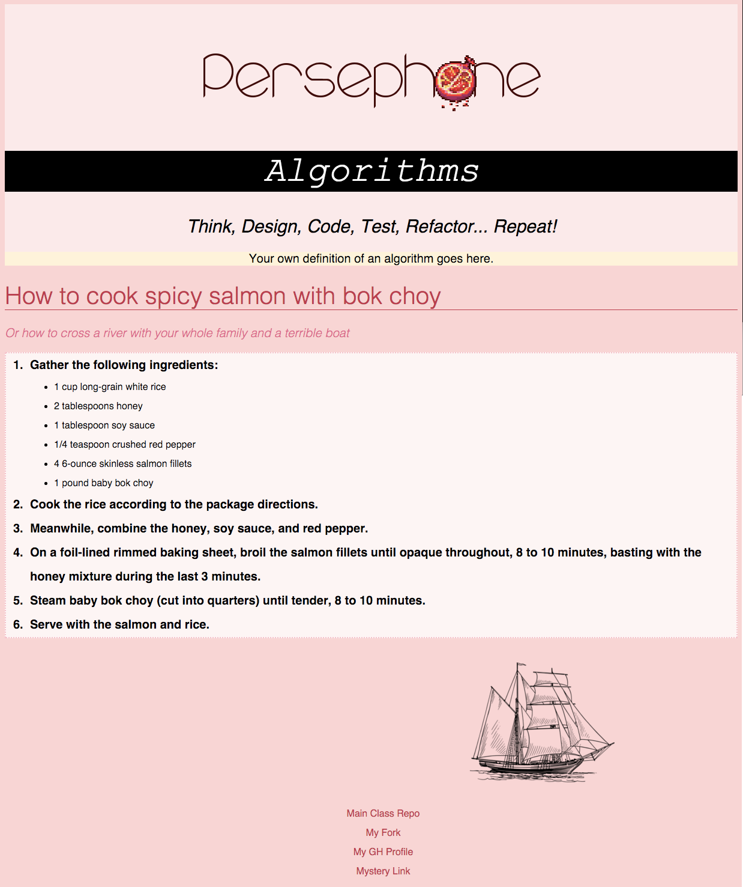

# Part One: Laundry List

Draw a diagram for how to fold your laundry. Take a picture and email it to [sung.choi@generalassemb.ly](sung.choi@generalassemb.ly)

# Part Two: Natural (CSS) Selection

#### ***Creating a simple display page using CSS & HTML***

Tonight, your task is use HTML and CSS to create a display page for an algorithm, or a step-by-step set of instructions. You will **style your page** using CSS selectors. In the example below, the page is divided into three separate parts: a `div` with a class of `header`, a `div` with a class of `main-content`, and a `div` with a class of footer. The instructions are displayed with a combination of ordered and unordered lists.

### Objectives

- Use a `<link>` tag to include a CSS file in your HTML document.
- Style all elements of a particular HTML element on a web page
- Pay attention to the difference between `class` and `id` selectors. How do you set an element's class or id? How do you refer to them in your CSS stylesheet?
- Apply a set of styles to the children of a specific class or tag

**Reference:**
- Here's a link to an [HTML cheatsheet](http://www.simplehtmlguide.com/cheatsheet.php) that will help you figure out which tags you need to use.
- The [MDN CSS Reference page](https://developer.mozilla.org/en-US/docs/Web/CSS/Reference) contains an exhaustive list of all CSS properties and how to use them - check them out, but don't get overwhelmed! If you need a review of selectors, there are a few links at the bottom of this page that will help you out.

## Directions:

### Part One - Creating the Header

1. **Create a new `index.html` file and set up your HTML boilerplate code inside of it.** Feel free to refer back to the MDN docs or the cheatsheet linked above if you need a reminder.
2. **Create and link your CSS stylesheet.** Create a new file called style.css. Use the `<link>` tag to include this file in your `index.html` document.
2. Feel free to add a CSS style rule that targets your `body` element. Change the `background-color` property to #ffd2d2 (or whatever color tickles your fancy).
3. **Create a header div.** Create a new `div` and give it a class of `header`. Add some content! Include the **Persephone** class logo, an `h1` proclaiming "Algorithms", an `h2` with "Think, Design, Code, Test, Refactor... Repeat!" inside, and a `p` tag that will contain your own definition of what an algorithm is.
4. **Style your header div.** Write a CSS style rule that targets your div with a class of `header`. Play around with different CSS style properties - what happens when you change the `background-color` property? The `border` property? `border-radius`? Check out the MDN docs (linked above) for syntax and ideas on how to use these!
5. **Style the text inside your header.** How will you target the text elements inside your div? Experiment with the following properties:
  - font-family
  - font-weight
  - font-style
  - font-size
  - background-color
  - color

### Part Two - List it Out

1. **Create a new div** for your main content, and give it a class of `main-content`. Write out the steps in your recipe/algorithm within this div as an ordered list (`ol`). Try writing CSS rules in your stylesheet that target your list specifically. Play with these properties:
  - line-height
  - font-size
  - font-weight
  - background-color
  - border
  - list-style-type
- **List in a list** How can we list sub-steps inside of our list items? Try nesting a `ul` with `li`s inside of one of your existing list items.
- Add an `h1` and `h2` to your `main-content` div. Style as you see fit.
- Create a new div with an id of `footer`. Add links to:
  - The main Persephone repository
  - Your **fork** of the Persephone repository
  - Your Github profile
  - A mystery link of your choice!!
  - **Style the links** in your footer.

### Bonus

Get creative! Explore the wonderful world of CSS styling. Ideas for fancy-fying include:

  - Add a background image to one or more of your divs
    - Modify its `background-size`
  - Add `span` elements with classes to highlight parts of your text
  - Play around with `background-color: rgba(....);` to create transparency
