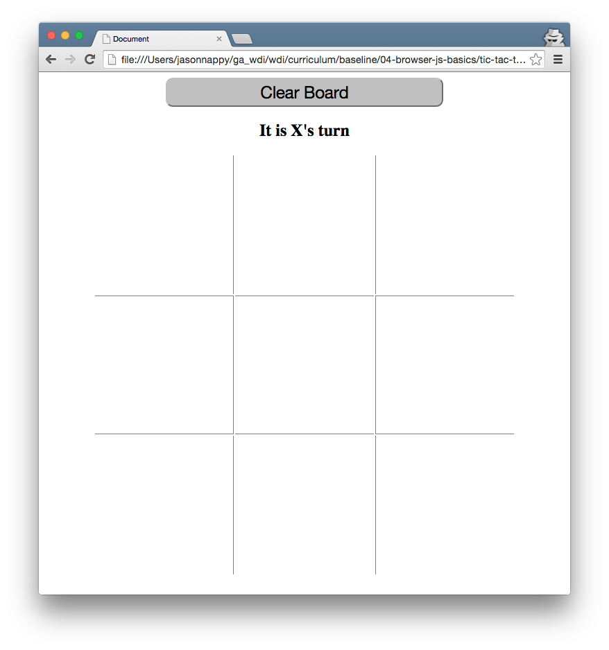
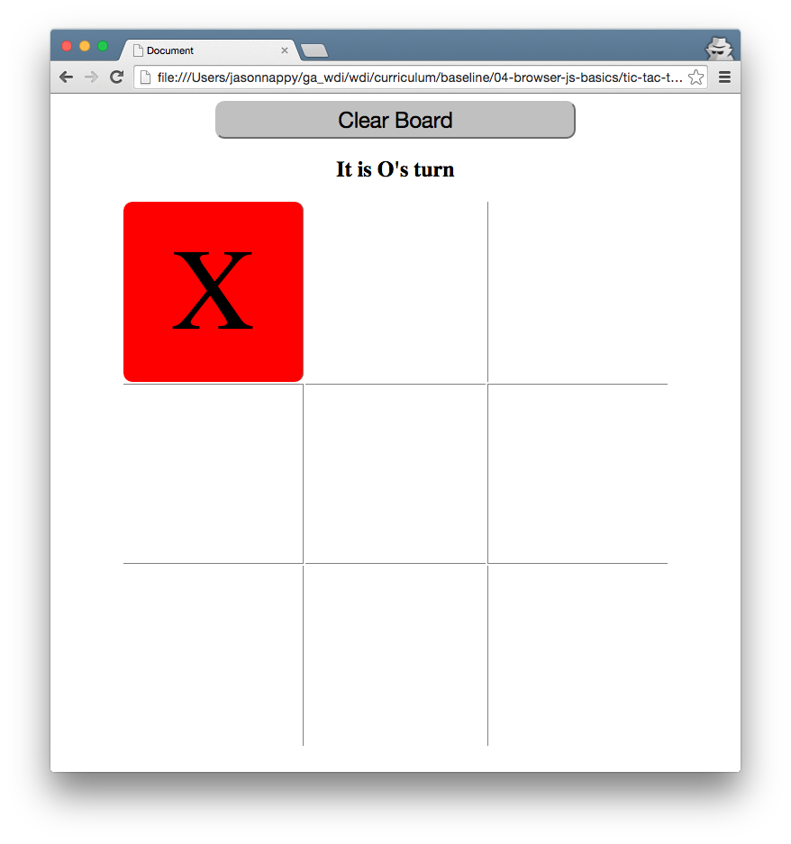
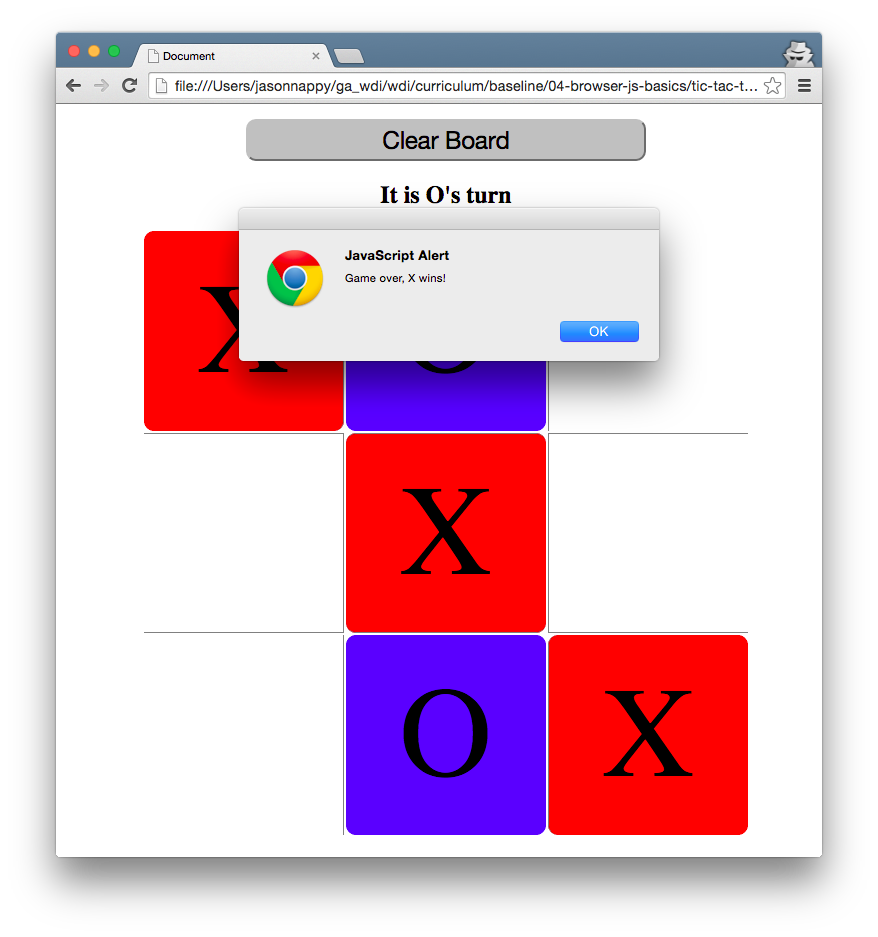

# Tic Tac TOEtally Awesome

## Introduction

This week, we have been learning about writing functions, working with loops, and writing conditionals. We also learned about how HTML elements are styled and behave in the DOM.

For this lab, you'll be building a tic tac toe game in HTML, CSS, and pure JavaScript.

## Exercise

#### Requirements

- A user should be able to click on different squares to make a move
- Every click will alternate between marking an `X` and `O`
- Upon marking of an individual cell, use JavaScript to add a class to each cell to display separate colors
- A cell should not be able to be replayed once marked
- Add a reset button that will clear the contents of the board

---

- Since this is one of our first extended labs, here are some __tips/hints__ to get started:

 - Construct a `index.html` to be your starting point on this project. Add your necessary HTML tags, including `script` and `link` tags to link to your JavaScript and CSS, respectively.

 - Before you even start working with JavaScript, construct the gameboard. The gameboard page should include the 3x3 grid and at minimum, a reset button. Using `id` and `class` on clickable elements will help you wire this up in JavaScript afterwards.

 - JavaScript portion will be next:

   * Locate the element first to use it within your app. Think about using `document.querySelector`, `document.querySelectorAll`, or something similar to locate your target elements. Try this in your console to make sure your selection works.

   * After finding the elements, start writing logic to listen for `click` events on those elements

   * You will also need a variable to keep track of moves - this will be used to indicate whether or not to draw an `X` or an `O`.

**Bonus:**

- Display a message to indicate which turn is about to be played
- After the necessary moves have been played, stop the game and alert the winner if one player ends up winning with three in a row
    * Hint: Determine a set of winning combinations. Check those combinations on the board contents after every move.

#### Starter code

There is no starter code provided for this lab.

#### Deliverable

Please find some screenshots of what you'll be creating below. Feel free to get creative with how you style your interface! (Perhaps make it spooky?)

#### Additional Resources

- Make sure you check out the class's [guides folder](https://github.com/ga-students/wdi-persephone/tree/master/guides) for guides on **debugging, event listeners, pseudocoding, style,** and ***so much more***!!
- **MDN's Introduction to the DOM** - [Important Data Types](https://developer.mozilla.org/en-US/docs/Web/API/Document_Object_Model/Introduction#Important_Data_Types) is a good review of the types of data we generally work with in the DOM. Also check out [Core Interfaces in the DOM](https://developer.mozilla.org/en-US/docs/Web/API/Document_Object_Model/Introduction#Core_Interfaces_in_the_DOM) for a clickable list of useful methods we've been using to interact with the DOM!
- [CSS Grids](https://css-tricks.com/dont-overthink-it-grids/) - While you can accomplish the creation of the tic-tac-toe board using floats and/or positioning each element, you might find it useful to create a simple grid system using CSS classes. The article linked here does cover a few things we haven't touched on in class yet, so don't feel obligated to use it.
- Don't be afraid to use the Google! Try out different search terms to see if you can narrow down your results and get what you want. For example, "how to get the value of an input using javascript" will give you very different results than simply typing "get text from textbox". Experiment with different searches until you get what you need!
