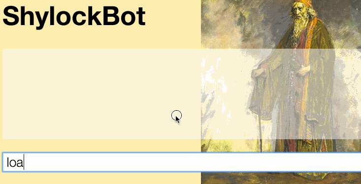

## The Tragedie of ShylockBot, ChatBot and Accountant



Your lab is to create a Interactive ChatBot lending program called ShylockBot.

## Prologue

For this project we're going to practice creating a [new Git project with a corresponding repo on Github](https://help.github.com/articles/create-a-repo/). That means you should be working in a new folder *outside* of your WDI folder!
You should have at least one commit per Act!

[Add the instructional team to your Repo as collaborators.](https://help.github.com/articles/adding-collaborators-to-a-personal-repository/)

Instructor | Github Name
:--   | :--
Phil | phlco
Sung | ~~ascotBoi86~~ sungchoi
Anna | annarankin

If you have questions today, and we hope you do, and we hope you ask them, please file a Github Issue and assign a member of the Instructional team!

### The User Interface

Start by building an interfacing using a HTML text input field with an id of `prompt`.

Create a `<ul id="log"></ul>` list container to store the chat history.

Whenever the user types in the text field and presses the `<return>` key, append a `<li>`
with the value from `prompt` to `ul#log`, then reset the value of `prompt`.

Shylock should process each command entered into the prompt and respond with the correct message.

Shylock's responses should be appended as `<li>` tags to `ul#log`.

Create each `<li>` with one of three possible classes:

- **command**  :  `The command from the prompt`
- **action**   :  *Indicates actions performed by Shylock*
- **quote**    :  For things ShylockBot says


## The Commands

#### How to read the examples.

```
> This is the command you type into the text prompt
- *This is Shylock's Action*
- This is Shylock's response
```

Given following commands, Shylock should respond with the corresponding messages.

> Note! Each example is just that, don't hard code values. These should work for any amount of money or any lender.

#### Act 1

ShylockBot starts off with 10,000 ducats.

```
> purse

- *ShylockBot pulls out his purse containing 10000 ducats*
```

#### Act 2

ShylockBot can lend money.

```
> loan Antonio 50 ducats

- *ShylockBot gives Antonio 50 ducats*

> loan Bassanio 25 ducats

- *ShylockBot gives Bassanio 25 ducats*
```

**Note!** What should `purse` now return?

#### Act 3

ShylockBot keeps track of his loans

```
> ledger

- *ShylockBot pulls out his ledger*
- Antonio owes me 50 ducats
- Bassanio owes me 25 ducats
```

#### Act 4

ShylockBot can collect interest from his accounts and set the interest rate

```
> collect interest

- *ShylockBot collects interest at 35%*
- Antonio now owes me 67.5 ducats
- Bassanio now owes me 33.75 ducats

> set interest at 15%

- *Shylock adjusts his interest rate from 35% to 15%*
```

#### Act 5

ShylockBot can collect debts

```
> collect 50 ducats from Antonio

- *Shylock opens his purse*
```

**Note!** What should `ledger` now return?

#### Epilogue: Bonus

Create a new feature branch called `feature-add-animation` and include the animate.css library.
Include some cool animations!

# FIN

## Resources

- https://developer.mozilla.org/en-US/docs/Web/JavaScript/Reference/Statements/for...in

- https://developer.mozilla.org/en-US/docs/Web/API/Element/scrollTop

- https://developer.mozilla.org/en-US/docs/Web/JavaScript/Reference/Statements/switch

- https://api.jquery.com/
