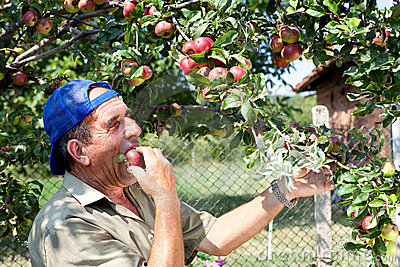

# Phil's Phabulous Phruit Pharm

## CRUDdin' crops

Phil has retired to the idyllic upstate New York countryside to pursue his lifelong dream of becoming an organic free-range fruit farmer. In order to keep track of his vast orchard of fruit trees, he needs YOU to build him a custom web application.

Phil wants to be able to expand - he's already on his way to becoming a land baron, with multiple farms to his name. Your app should track his three separate farms in:

- Rosendale
- Eddyville
- Wappingers Falls

### Farms

You should track the following data about each farm:

1. Nickname
1. Mailing address
1. Latitude
1. Longitude
1. Phone Number
1. Name of supervisor

### Crops

Each farm will have many different crops growing on it at different points throughout the year. Your application will track the following info about each crop: 

1. **color**
1. **type** (phava beans?)
1. **quantity** of plants
1. anticipated **harvest date**

***This data will be persisted to a SQLite3 database.***

### Deliverables

Your rustic client should be able to:

1. See a page that lists all current farms.
2. **Create** a new farm.
1. See a page that lists all current fruit crops **for each farm**.
2. **Create** a new fruit crop.
4. **Delete** an existing fruit crop - in case of locust plagues or shifting market trends.

Your application should use ERB to render templates into dynamically created HTML.

## Bonuses:

1. Set up your index page to display all crops alphabetically. User experience, wow! Is there a way to do this using a SQL query?
1. Now, go further - allow your user to list crops alphabetically, by harvest date, or quantity.
