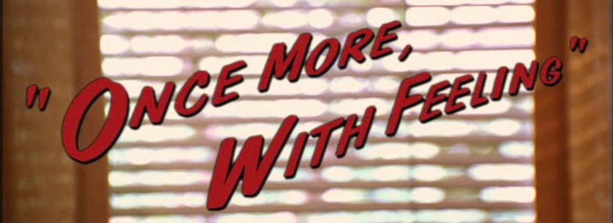

# Let's _Iterate!_



### Objectives:

1. Refactor your project's MVP by re-creating it using Rails instead of Sinatra.

## Project Two, Round Two

This weekend, you'll be refactoring your second project to run on Rails instead of Sinatra! You'll need to figure out how to translate the problems you solved and the code you wrote last week into a different framework's vocabulary. This is a chance to iterate on your original project

As you go along, question everything. For example - *Will my `seeds.rb` file still work? How are my routes set up differently? Do I need to change my views? How do controllers fit in?*

Pay attention to how the details change, but the overall concepts stay pretty much the same.

### Deliverables

1. You must create an application that:
  - Meets the "Necessary Features" requirements listed in the [Forum](https://github.com/ga-students/wdi-persephone/blob/master/projects/project_two/02_proj_forum.md) or [Wiki](https://github.com/ga-students/wdi-persephone/blob/master/projects/project_two/02_proj_wiki.md) prompt
  - Delivers up the same content and functionality as your second project
  - Is deployed on Heroku

### Tips & Tricks

Add your **static assets** to the public folder, just like you did on Sinatra.

```html
<head>
  <title>SampleApp</title>
  <%= stylesheet_link_tag    'application', media: 'all', 'data-turbolinks-track' => true %>
  <%= javascript_include_tag 'application', 'data-turbolinks-track' => true %>
  <%= csrf_meta_tags %>
  <!-- serve your own assets from public -->
  <script src="/css/main.js"></script>
  <link rel="stylesheet" href="/js/main.css">
</head>
```

For **user login** - consider including the following routes in tour `config/routes.rb` file.

```ruby
# This implies a controller called what?
# And a view folder called what?
get '/login' => 'sessions#new'
post '/login' => 'sessions#create' # Where should this redirect to?
delete '/login' => 'sessions#destroy'

```

The `bcrypt` gem is included by default in your Rails app's Gemfile - make sure you uncomment it so that you can use it!

```ruby
# Use ActiveModel has_secure_password
gem 'bcrypt', '~> 3.1.7'
```

### Good Ideas

1. **Start from the beginning** - make a **checklist** of tasks for yourself, including:
    - Database setup tasks
    - ORM (ActiveRecord in this case) setup tasks
    - Routes, Controllers, Views/Template logic
    - Linking static assets
1. **Don't Panic!** - The problems you solved during your first project sprint don't need to be re-solved. You already know how to implement this project; the challenge is just in the translation.
1. **Test Everything All the Time** - Take advantage of the web browser's IRB console, `rails console`. **I strongly encourage you to include the `pry-rails` gem in your project!**
1. **Stay Organized** - Consider using a service like [Trello](https://trello.com/) to categorize and keep track of your tasks. This will be good practice for your group project, and will help you stay stress-free and on track!
1. **Write out your code.** Repetition is more important than you might think, especially if you're having trouble with syntax. Use this time to improve your muscle memory and typing speed!

### Bad Ideas

1. **Wholesale Copying/Pasting**
    - The exact code that worked in Sinatra is not going to work in Rails. It's important to look at files and parts of your old code and determine where that will go in your refactored application.
    - Make sure you can explain why a piece of code you included in your refactored project is there! If it's not doing anything, it doesn't belong.
