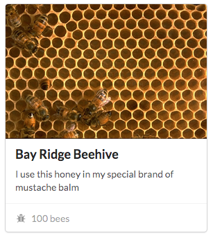
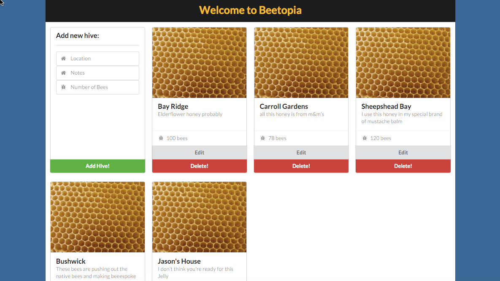

# Urban Apiary

Bees are disappearing from the world at large at an alarming rate! You've ***bee***n tasked with creating a **single page web application (SPA)** to help [NYC Urban Beekeeper Zane "Honeybear" Potts](https://pbs.twimg.com/media/BSScjxrCYAAngQQ.jpg) keep track of the beehives he's keeping all over the borough of Brooklyn.

### Objectives:

You'll be building out the front and back ends of this application.

- Use Express to build out your server
- Use AJAX to make GET, PUT, POST and DELETE requests from your client-side JavaScript.

### User Stories:

A user should ***bee*** able to: 

- see a list of all their beehives on the main page
- create a new beehive
- edit an existing beehive
- delete an existing beehive

...all without reloading the page! Keep in mind - you'll need to figure out how to deal with IDs (keeping them unique, looking up a hive by ID, etc.). 

### Further features:

- Each beehive in the list should display an image of a beehive.
- Ten seconds after the user loads the page, a [toast](http://ux.stackexchange.com/questions/11998/what-is-a-toast-notification) will pop up on the screen and prompt the user to sign up for Zane's newsletter - "Honeycombing Quarterly"
- Add an 'About' link that, when clicked, will pop up a modal containing information about Zane's enterprise - include a photo of terrifying bees!

**yaasss queen**

You're responsible for writing the logic to load and display all the beehives, make calls to your server, AND managing what happens to elements on the DOM when a CRUD action takes place.

### Style

Remember CSS? Use [Pure.css](http://purecss.io/) **or** check out the [Semantic UI](http://semantic-ui.com/) CSS framework over the weekend. Try creating your own [card](https://www.google.com/design/spec/components/cards.html), or use the [card](http://semantic-ui.com/views/card.html) module to display information about a specific beehive.

### Resources

- [What is a Card Layout?](https://www.google.com/design/spec/components/cards.html)

***Example:***

## Bonus: Get the Latest Buzz

Use your newfound knowledge of websockets and `socket.io` to add a new feature to Zane's website - **"What's the Buzz?"** 

This feature will enable users of the site to participate in a side chat about bees, honey, and ask live questions about the latest beekeeping trends.

- The chat window should be displayed as a column on the right side of the page.
- The chat history should be **persisted** in some way.
- Allow users to **hide the chat box** if they don't want to see it.
- When the chat window is hidden, a tab on the right side of the screen should appear. When the user clicks this tab, the chat window should reappear.
- **Bonus:** Use CSS transitions to animate the chat log's appearance and disappearance.

_Whatever you do, don't image search "Nicholas Cage bees" - seriously_
