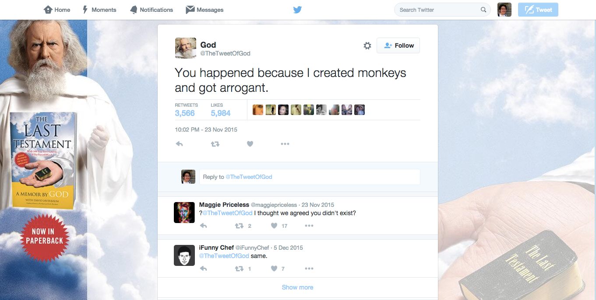

# Twitter Bootstrap

[Twitter Bootstrap v3 Website](http://getbootstrap.com/)

Twitter Bootstrap is a large CSS Framework created, used, and shared by Twitter. Think of it as the framework with the kitchensink, bathwater, and baby thrown in.

Other Frameworks Big and Small:

- [Zurb Foundation](http://foundation.zurb.com/)
- [Semantic UI](http://semantic-ui.com/)
- [Pure CSS](http://purecss.io/)
- [Toast](http://daneden.github.io/Toast/)
- And more!

## The Twitter God Commands It!

Write HTML to recreate the following page:

## Remember

Use Bower to install Bootstrap.
Remember to load **all** parts Twitter Bootstrap and its dependencies into your page.

Remember, Twitter pretty much already wrote all of your CSS for you. You mostly just need to write the HTML with the correct classes. If you find yourself writing a bunch of CSS, something is wrong.

## Assets
God's profile picture: https://pbs.twimg.com/profile_images/577952058680070144/6hlNZ0_Y_bigger.jpeg

God's background: https://pbs.twimg.com/profile_background_images/669399124/4e7bc584e8f2600aa4d8f8e9f60601d1.jpeg
