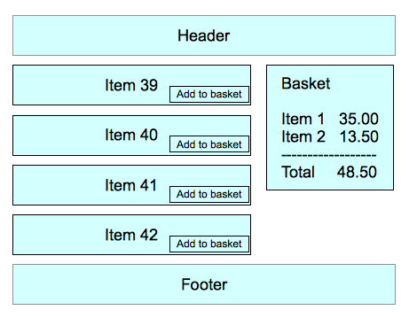

# MVC Patterns

Spend 5 minutes readig through the following text [exceperted from Addy Osmani's blog](https://addyosmani.com/blog/understanding-mvc-and-mvp-for-javascript-and-backbone-developers/)

MVC is an architectural design pattern that encourages improved application organization through a separation of concerns. It enforces the isolation of business data (Models) from user interfaces (Views), with a third component (Controllers) traditionally managing logic, user-input, and coordination of Models and Views. The pattern was originally designed by Trygve Reenskaug while working on Smalltalk-80 (1979), where it was initially called Model-View-Controller-Editor. MVC was described in depth in "Design Patterns: Elements of Reusable Object-Oriented Software" (The "GoF" or "Gang of Four" book) in 1994, which played a role in popularizing its use.

Smalltalk-80 MVC

It’s important to understand the issues that the original MVC pattern was aiming to solve as it has changed quite heavily since the days of its origin. Back in the 70’s, graphical user-interfaces were few and far between. An approach known as Separated Presentation began to be used as a means to make a clear division between domain objects which modeled concepts in the real world (e.g., a photo, a person) and the presentation objects which were rendered to the user’s screen.

The Smalltalk-80 implementation of MVC took this concept further and had an objective of separating out the application logic from the user interface. The idea was that decoupling these parts of the application would also allow the reuse of Models for other interfaces in the application. There are some interesting points worth noting about Smalltalk-80’s MVC architecture:

A Domain element was known as a Model and was ignorant of the user-interface (Views and Controllers)
Presentation was taken care of by the View and the Controller, but there wasn’t just a single View and Controller. A View-Controller pair was required for each element being displayed on the screen and so there was no true separation between them
The Controller’s role in this pair was handling user input (such as key-presses and click events) and doing something sensible with them

The Observer pattern was used to update the View whenever the Model changed

Developers are sometimes surprised when they learn that the Observer pattern (nowadays commonly implemented as a Publish/Subscribe system) was included as a part of MVC’s architecture decades ago. In Smalltalk-80’s MVC, the View and Controller both observe the Model: anytime the Model changes, the Views react. A simple example of this is an application backed by stock market data - for the application to show real-time information, any change to the data in its Model should result in the View being refreshed instantly.

# Questions to ask yourself

- What is MVC?
- What's a model?
- What's a controller?
- What's a view?
- What are the MVC components of a Playstation 4?
- What's the observer pattern?

# Thought Experiment

Let's say we wanted to create a single page application that displays a list of shopping items.
Each item can be added to a shopping cart.
As we add items, the shopping cart should display a total that automatically updates.

Spend 10 minutes with your neighbor and plan out how you would structure your client-side JavaScript code into an MVC pattern.

- What would the user interaction be?
- What are the domain objects?
- What are the presentation objects?
- What views/controllers would you create?

You can pseudo code out any code you want in the [thought_experiment](thought_experiment) folder

# MVVM

Spend another 5 minutes reading through the following wikipedia page on MVVM

# Questions to ask yourself

- What's a view-model?
- What's data binding?
- What's a criticism of it?

https://en.wikipedia.org/wiki/Model%E2%80%93view%E2%80%93viewmodel
