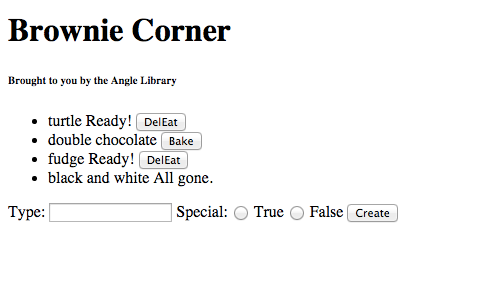

# Brownie Corner


## Single Page Application

> Your project manager is frustrated with the client's demands to use Angular. Putting up her hands, she says, "She should really grow a backbone and have the guts to talk to me face to face instead of sending over her assistant. Doesn't anyone know how to react properly to social interactions anymore?! If she wants an angle, I'll give her an angle!"



### Part 1: Show Me the Brownies!

> On another phone call, you over hear the client, the project manager's mother, saying, "Honey, I just want you to show me the brownies!".


Create a single page angular application. The server will simply serve the static page (index.html) and assets (js, css, and possibly json files) like we did in class. Angular will make it feel dynamic. We will simply use an in-memory array for data storage.

Command for Python's Simple Server:
```bash
python -m SimpleHTTPServer 3000
```
This will serve the webpage at `http://0.0.0.0:3000/`.

Given a collection of brownies.
Example:
```
[{
  "type": 'turtle',
  "isReady": true,
  "isBaking": false,
  "isEaten": false,
  "isSpecial": true
},
{
  "type": 'double chocolate',
  "isReady": false,
  "isBaking": false,
  "isEaten": false,
  "isSpecial": false
},
{
  "type": 'fudge',
  "isReady": true,
  "isBaking": false,
  "isEaten": false,
  "isSpecial": true
},
{
  "type": 'black and white',
  "isReady": false,
  "isBaking": false,
  "isEaten": true,
  "isSpecial": false
}]
```

- Display a list of all the brownies with their id, type, baking state, ready state, and eaten state.

### Part II: Get Baked and Eat It Too.


- If the brownie is not ready and is not baking, it should also have a `Bake` button. When the Bake button is clicked, the app will turn the isBaking state to true and will wait 3 seconds before it updates the brownie's isReady state to true (and turns the isBaking state back to false).
- If the brownie is ready and not eaten, it should show a `DelEat` button. When the DelEat button is clicked, the app will immediately change the brownie's isEaten state to true.

### Part III: More Munchies! More Brownies!


Oh no! We've eaten all the brownies. Let's make some more.

- Create a form that
    - on submit creates a new brownie and adds it to the brownie collection.
    - the list should update to show the new brownie.


