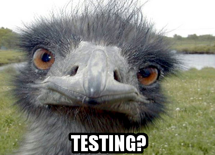

# The Acquisition (Birds that Pivot)

After consulting with a brand expert and psychic, `professionalnobodies.biz` has decided to pivot and become `seriouscompany.biz`.

In addition to a spending splurge, they've dedicated some money to improving existing sites.  "It's time to shape up," says the CTO. "We're going to overhaul all our clients." "But the site works," you say. "Yeah but no work, no money," says the company barista.

***Objective:*** Port the existing **Birdwatchr** site's basic functionality to Angular.

- You've been given a [basic, working version of the Birdwatchr app](https://github.com/phlco/birdwatchr/tree/master) to start out with. Create a fork of this repo and clone it down.
- Use Angular to convert this traditionally structured website into a single-page application.
- Spotting a bird & the form to add a new bird should appear on the index page rather than a separate page.
- When a new sighting is added, your "Recent Sightings" section should be updated.

**You'll need one controller for this application.**

You run into Rashida from User Experience Design (designer's name: CHECK). "Did you ever finish up those geocoding features we talked about?" she asks. You murmur something into your fresh-pressed carrot/beet juice and walk away quickly.

- **Implement geocoding in your application.** When a new bird sighting is recorded, include the geolocation data for the address the user enters into the form and store it in your database. Utilize the [npm package geocoder](https://www.npmjs.com/package/geocoder) to accomplish this.
- Display this data on your page as [a link to a Google Maps marker](http://webapps.stackexchange.com/questions/4438/create-a-google-maps-link-to-a-specific-location)!

### Bonus: Testing Your Limits

A new hotshot replies to an ad based on the company name. He corners you by the popcorn machine. "I thought this place was legit, but there's no end-to-end testing! What gives?" Jill from HR leans in and whispers: "Is this appropriate workplace talk??" You explain that end-to-end testing actually means writing comprehensive tests for your application that ensure it works from start to finish.

The CTO overhears your explanation, claps you on the back, and tells you to implement testing for Birdwatchr over the weekend. "But I've never done that before," you protest. "Great, since you'll be learning something new, this time can come out of your professional development budget!" he replies, skimming through pictures of his Soviet tank collection on his phone.

***Objectives:*** Implement end to end [Protractor tests](https://github.com/phlco/birdwatchr/blob/master/testing.md) for basic functionality of your app.

#### Basic User Stories

- When a user visits the site, they should see a list of bird sightings appear on the page.
- When a user types in information about a bird sighting and hit submit, that information should appear on page.
- Once you get these working, feel free to write tests for other basic user stories for your application. What user stories are vital to the functionality of your app? What could break your application?

