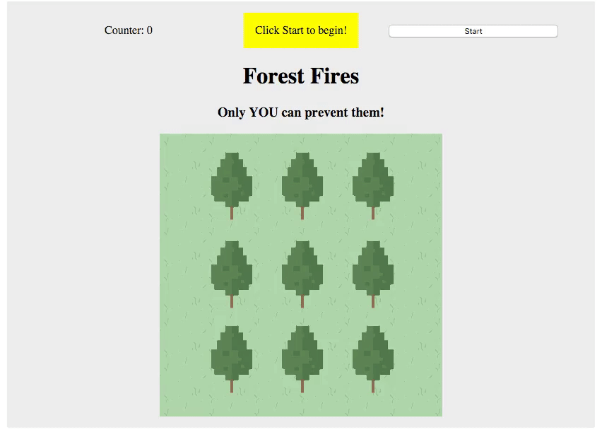

# Forest Fires!

Your goal - build a browser-based game where the user must put out fires to save a tiny forest!

### Objectives:

1. Practice creating and appending new elements to the DOM using jQuery.
1. Practice assigning and removing event listeners as needed.
1. Practice setting and clearing intervals.

As you can see, the focus for this exercise is problem-solving using JavaScript - you've been provided with HTML, CSS, and images to work with. You should use JavaScript to add elements to your page dynamically, as needed.

Your job is to figure out how to make your game function - break down the problem into logical steps. What needs to happen, and when? Try sketching out the various stages of your game. Create a step-by-step list of features and tasks you'll need to complete.

> How will your user get from one stage to the next?  
> How will they know they've won?  
> How should you organize your code?  

### Deliverables:

1. When a user navigates to your game's page, they should see a "Start" button and a gameboard populated with several trees. 
1. When this button is clicked, the game should begin.
1. Once the game has begun, all your trees should "catch on fire," or have a flame animation superimposed on them. The user must click each tree to "put out" the fire and save the tree.
1. Once the game starts, the user should see a countdown timer displayed on the screen.
1. Every second during gameplay, one of the non-burning trees (if there are any) should catch fire.
1. Ten seconds after the game starts, the game should end. The result (how many trees are not on fire at the end of the game) should be displayed to the user.

### Example:

### Bonus

If you're ever bored...

- Allow the user to choose difficulty levels - more trees, higher difficulty!
- Create a temporary high score list - every time the user plays, add a new score to the list.
- Try saving high scores! Create a simple Sinatra server and use AJAX and a database to save a record of every game played, then display this to the user. OR, consider looking into using [Firebase](https://www.firebase.com/) to save your high scores.
