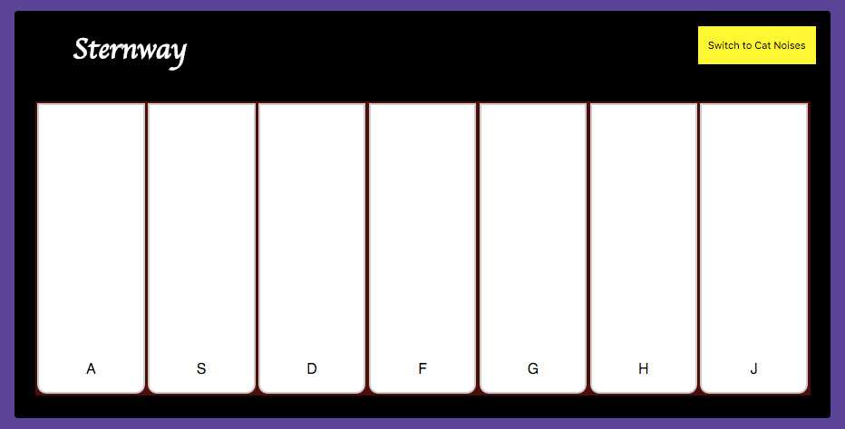

# A Different Kind of Keyboard


***Create a simple piano using CSS, HTML, and JavaScript***

You've been given a basic folder structure and a mockup.


It's up to you to implement the following user stories and rock out the holidays.

Your user stories:

1. When the user loads the page, they should see an representation of a piano keyboard with 7 white keys displayed in their browser.
1. When the user hovers over a key, it should turn light grey. When a key is pressed, it should turn light yellow.
1. When a user clicks on a key, a piano sound should play.
1. A user should be able to play the scales - when a user clicks on a specific piano key - for example, the first one - the corresponding sound should play (see the piano audio in the `src/audio` folder).
1. A user should also be able to play the piano using the keyboard. See the image below for an example of a finished piano.



## Playing Embedded Audio in the Browser

In order to implement sound functionality there are included audio files under "public/audio". It'll be up to you to write a method to trigger them.

The [MDN guide to HTML5 audio & video](https://developer.mozilla.org/en-US/docs/Web/Guide/HTML/Using_HTML5_audio_and_video) is a very good resource. Your overall workflow will look like this:

1. Embed the audio in your HTML document.
1. In your JavaScript file, grab a reference to that `<audio>` element.
1. Call `.play()` on that object in response to an event.

#### Useful Methods & Properties:

```javascript
noise.play();
noise.pause();
// How might being able to set the currently playing
// time of an audio clip come in handy?
noise.currentTime
```

## Bonus

1. Create a button on the piano that allows the user to switch from "regular" piano noises... to cat sounds! You've been provided with seven cat audio clips.
1. Create the black keys using CSS, HTML, and JS! You've been provided with additional piano key sounds for this.
